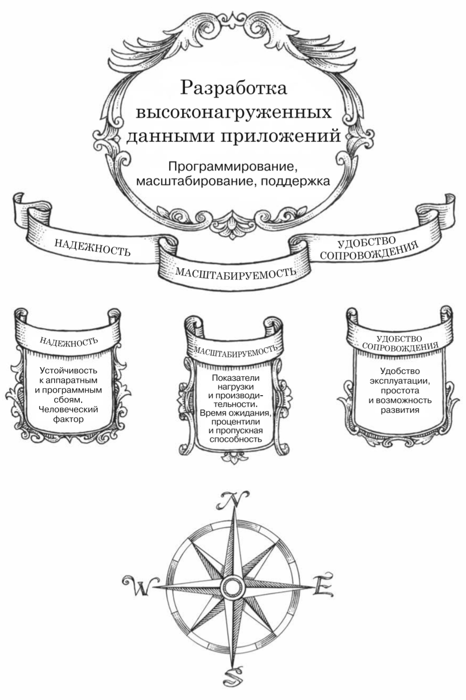

Высоконагруженные данными приложения (DIA) сталкиваются с проблемами объема, сложности и скорости изменения данных, а не с ограничениями производительности CPU. Эти приложения используют стандартные блоки: базы данных, кэши, поисковые индексы, потоковую и пакетную обработку. Выбор инструментов и подходов для решения задач зависит от требований приложения. Основные цели при создании DIA — надежность, масштабируемость и удобство сопровождения.

[[1.1. Подходы к работе  над информационными системами]]